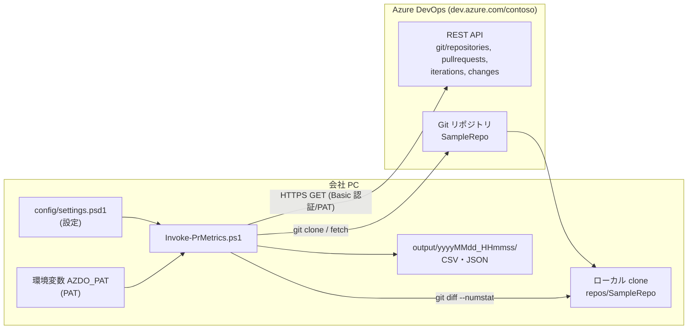
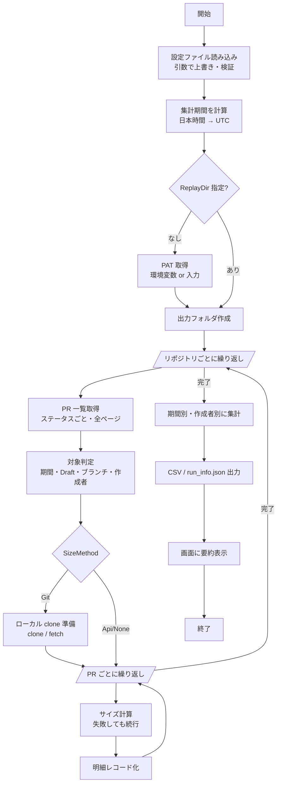

# 02. 基本設計

## 1. 全体構成



## 2. モジュール構成

| ファイル | 役割 | 主な関数 |
|---|---|---|
| `Invoke-PrMetrics.ps1` | エントリポイント。引数を受け取り、全体の流れを制御する | （スクリプト本体）、`Invoke-ConnectionTest` |
| `src/Config.ps1` | 設定の読み込み・既定値補完・検証、期間と日時の計算 | `Import-PrMetricsConfig`, `Get-PrMetricsDateRange`, `ConvertTo-UtcDateTime` |
| `src/AzDoClient.ps1` | REST API 呼び出し（認証・URL 組み立て・再試行・ページング） | `Invoke-AzDoApi`, `Get-AzDoPullRequests`, `Get-AzDoPullRequestIterationChanges` |
| `src/SizeCalculator.ps1` | PR サイズの計算（Git 方式 / Api 方式）、サイズ区分 | `Get-PrSizeFromGit`, `Get-PrSizeFromApi`, `Get-PrSizeCategory` |
| `src/Aggregator.ps1` | 対象判定・明細レコード化・期間別/作成者別集計 | `Test-PullRequestIncluded`, `ConvertTo-PrRecord`, `Get-PeriodSummary` |
| `src/Output.ps1` | CSV/JSON の入出力、画面表示 | `Export-PrMetricsCsv`, `Write-PrMetricsConsoleSummary` |
| `tests/Run-Tests.ps1` | 単体テスト（接続不要） | — |

依存の向き（上が下を使う）:

```
Invoke-PrMetrics.ps1
  ├─ Config.ps1           （どこからも使われる共通部品）
  ├─ AzDoClient.ps1
  ├─ SizeCalculator.ps1  → AzDoClient.ps1（Api 方式のみ）, Config.ps1
  ├─ Aggregator.ps1      → SizeCalculator.ps1（区分判定）, Config.ps1
  └─ Output.ps1
```

各ファイルは **dot-source（`. .\src\xxx.ps1`）で読み込む** 単純な構成にしている（モジュール化・マニフェストは使わない）。

## 3. 処理フロー（Collect モード）



`-Mode TestConnection` の場合は、PAT 取得のあとに接続確認だけを行い、ファイルを出力せずに終了する。

## 4. データの流れ

```
[API] PR オブジェクト (JSON)
   │  Test-PullRequestIncluded で絞り込み
   ▼
[SizeCalculator] サイズ結果 (FilesChanged, LinesAdded, ... , SizeSource, SizeNote)
   │  ConvertTo-PrRecord で結合・日時を日本時間に変換・Period を付与
   ▼
[Aggregator] 明細レコード（prs.csv の 1 行）
   │  Get-PeriodSummary / Get-AuthorSummary
   ▼
[Output] summary_by_period.csv / summary_by_author.csv
```

## 5. 設計判断（なぜこうしたか）

### D-01. PowerShell 5.1 互換のスクリプトにする
- **理由**: 会社 PC に標準で入っており、Python やモジュールのインストール申請が不要。
- **影響**: `??` や三項演算子、`ConvertFrom-Json -AsHashtable` など PowerShell 7 専用の構文は使わない。
  スクリプトは **UTF-8（BOM 付き）** で保存する（BOM が無いと 5.1 が Shift-JIS として読み、日本語が化ける）。

### D-02. 設定は `.psd1`（PowerShell データファイル）にする
- **理由**: JSON と違ってコメントを書ける。設定ファイル自体を説明書にできる。
  `Import-PowerShellDataFile` で読むため、任意のコードは実行されない（安全）。
- **代替案**: JSON（コメント不可）、YAML（5.1 に標準パーサーが無い）。

### D-03. PAT は環境変数で渡す
- **理由**: 設定ファイルを Git 管理や共有をしても PAT が漏れない。未設定時は画面入力（非表示）にフォールバックする。

### D-04. サイズ（行数）は git で計算する
- **理由**: REST API には PR の変更行数を返す項目が無い。ファイルごとの差分 API（`fileDiffs`）はファイル数 × PR 数だけ呼ぶ必要があり遅い。
  git の `diff --numstat` は 1 PR につき 1 回で済み、正確。
- **代替**: Git が使えない環境向けに、API だけでファイル数を数える `Api` 方式と、計算しない `None` 方式を用意した。

### D-05. 差分は「マージ先コミット → マージコミット」で取る
- **理由**: マージコミット（またはスカッシュコミット）とマージ直前のマージ先コミットの差分は、「その PR がマージ先に持ち込んだ変更」そのもの。
  ソースブランチを削除済みでも、マージコミットはマージ先の履歴に残るので計算できる。
- **フォールバック**: マージコミットが無い・取得できない場合は、`マージ先...ソース`（共通祖先からの差分）で計算する。
  どの方式で計算したかを `SizeSource` 列に残す。

### D-06. clone は `--mirror` で行う
- **理由**: 作業ツリーが不要（容量削減）。`refs/pull/*` を含む全 ref を取得するので、未完了 PR のコミットも取れる可能性が高い。
  既存の作業用 clone がある場合は、それをそのまま使える（`LocalRepoRoot` で指定）。

### D-07. 期間の絞り込みはサーバー側とツール側の二重で行う
- **理由**: サーバー側の絞り込み（`searchCriteria.minTime` 等）で転送量を減らしつつ、境界の扱い（含む/含まない）やタイムゾーンの判定はツール側で厳密に行う。
  サーバーが絞り込みに対応しない場合（古い Azure DevOps Server）は、`UseServerSideDateFilter=$false` でツール側だけで行う。

### D-08. 一部失敗しても続行し、理由を残す
- **理由**: 数百件のうち 1 件のコミット欠落で全体が止まると使いにくい。失敗した PR はサイズを空欄にし、`SizeSource=unavailable` と `SizeNote` に理由を書く。
  ただし認証エラー・リポジトリ名の誤りなど全体に影響するエラーは即時停止する。

### D-09. 中央値を主指標にする
- **理由**: PR のサイズとリードタイムは極端な値（巨大 PR・放置 PR）があり、平均が実態より大きく出やすい。

## 6. セキュリティ設計

| 項目 | 対策 |
|---|---|
| PAT の保管 | 設定ファイルには書かない。環境変数（プロセス→ユーザー）から読む |
| PAT の表示 | 画面・ログ・`run_info.json` に出さない。`-Verbose` の URL にも含まれない（ヘッダーで送るため） |
| git 認証 | 既定は PC の Git Credential Manager。`GitUsePatHeader=$true` のときだけ、その git 実行の間だけ `-c http.extraHeader` で渡す（git の設定ファイルには保存しない） |
| 権限 | PAT のスコープは Code (Read) のみで足りる。書き込み系 API は使わない |
| 出力データ | `prs.csv` には作成者名・メールアドレスが含まれる。社外に出さない |

## 7. エラー処理方針

| 種類 | 例 | 振る舞い |
|---|---|---|
| 設定誤り | 不正な値・日付形式誤り | 開始前にすべての誤りをまとめて表示して終了（終了コード 1） |
| 認証・権限・名前の誤り | 401 / 403 / 404 / 203(HTML) | 再試行せず、原因のヒント付きで終了（終了コード 1） |
| 一時的な障害 | 429 / 5xx / 通信断 | `MaxRetry` 回まで、待ち時間を倍々にして再試行 |
| PR 単位のサイズ計算失敗 | コミット未取得 | 警告を出して続行。明細に理由を残す |
| git fetch 失敗 | ネットワーク | 警告を出し、ローカルにある内容で続行 |

詳細なエラー別の対処は [08 トラブルシューティング](08_トラブルシューティング.md) を参照。
